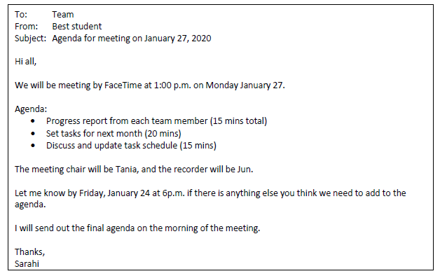
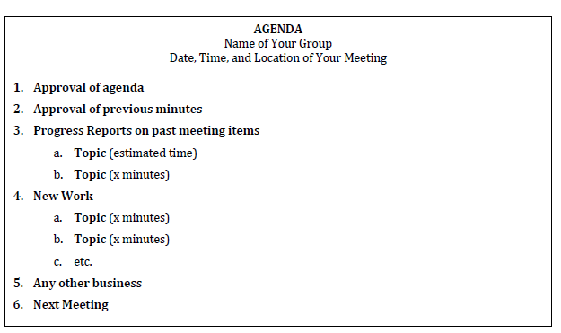
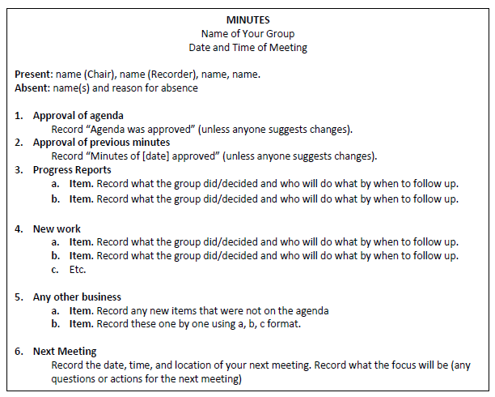

# Meetings

A team meeting is focused on one topic: **action**.

During any team meeting, you discuss, decide on, review, and complete project tasks. All these items require action.

Team meetings can have a level of formality that is good to learn. That way, you have experienced this type of meeting and can evaluate how effective it is.

In the workplace, more formal team meetings happen to discuss and *document* work. Because the meeting is documented, we know who said what they would do, by when, and to what level, for example. This means any project has *accountability*, and this accountability is useful if things should go wrong. We have a record of people saying what they are doing, and this record helps companies and project leaders to track progress.

The accountability also helps because as a member of a team, you know what you are expected to do and by when. This expectation means you know what your tasks are up to the next meeting, and this clarity can help your workflow.

You will attend many meetings in your careers, where you will have to show work, progress, and you will sometimes need to prepare meeting documents. So, practice effective meetings, and see if they are valuable for you, your projects, and your future work.

## What will meetings be about?

meetings are an excellent way to check in with all members about the following:

- How is the project developing? Progress updates are essential.
- Are people on track? Make sure the task schedule is being followed.
- Does the team agree with the work being done? Make sure you have consensus through discussion.
- Is the workload distribution fair? Make sure everyone is happy with task allocation.
- Are there any issues that needs addressing/resolving? Clear up issues in meetings.
- Are all members contributing to the best of their abilities?
- Do any members need extra help/clarification? Should the team help or should the member consult the instructor?

Use your teamwork skills to address and resolve any issues. However, please also ask your instructors for help as needed, and keep your lab instructor informed of any challenges. Do not leave any issues unresolved; handle them (with instructor help as needed) right away! Asking for help and dealing with issues are key skills that will benefit you in your career.

## What are the roles in team meetings?

During a project, you will each 

- create agendas,
- chair meetings,
- and record meeting minutes according to the schedule your group decides.

**Agenda**: One person creates and distributes an agenda three days up to a day before the meeting.

**Meeting**: The Chair runs the meeting using the agenda

**Minutes**: The Recorder of each meeting takes notes during the meeting and distributes the minutes to instructors and the team within a day of the meeting.

It is good practice to try all three parts of a meeting. When you start out, it can feel uncomfortable and weird doing these things. But, people will appreciate you for organizing, running, and documenting meetings well. It is surprising how poorly some meetings are run; when we go to well run meetings, we are really thankful. Why? We are all busy and don't need our time wasted.

Let's look at the elements of a meeting, starting with before the meeting.

## The agenda

The agenda is simply a list of everything that will be discussed and agreed on in the meeting. It allows the person running the meeting (the Chair) to go through item one by one.

A solid agenda has the topic and a prediction of how long it could take to complete the agenda item.

Say at the last meeting, you were tasked with organizing a task list into themes, your agenda item might be "Update on task list, Sam" and you think this will take 5 minutes maximum. The agenda item looks like this:

- Sam: update on task list (5 mins).

Your agenda is therefore a list of items for the meeting. Let's see how to create it.

### Creating the agenda

The main goal of the agenda is to decide what you want to get done at the meeting.

As stated above, the agenda is a list of topics that you will work on in the meeting.

In the meeting itself, you can add any new information that is not on the list (this gets added to *Any Other Business* at the end of the meeting), but one goal of the agenda is to make sure all the important information you need to discuss is included *beforehand*.

Agendas can include the following:

- **Information**: For example, this could be updates on work.
- **Action items**: what actions do you want to review and what actions do you want to set? For example, Sunny will conduct user tests on March 12
- **Discussion**: what things do you want the team to discuss? For example, do we all like the graphics? do we need to change the order of navigation links?

Everyone should/could add to the agenda, and the person responsible for the agenda should get feedback from all teammates on what they’d like to include.

This feedback can be sent via email or other communication channel (like Discord/Slack). It can look like this sample

Key to the communication is to state what is already included, what the roles will be, and the date for any additional agendas items to be added.

You can see predicted times for each item. If you know the meeting is 1 hour, then add the times appropriately.

The person responsible for the agenda should then update the document, share it with teammates (your choice of communication), and bring it to the meeting.

See what the final agenda looks like below:

### Agenda Item Explanations

1. Approval of Agenda. This is a standard item, so simply copy it as the #1 item for each meeting’s agenda. It allows members to either approve the topics or change them as the first meeting action. Every agenda (including the first one) should have this item first.
2. Approval of Minutes. This is a standard item, so copy it as the #2 item for each meeting’s agenda. It allows members to change/correct any problems they noticed with the meeting minutes from the last meeting. Every agenda (except the first one) should have this item second.
3. Progress Reports on items from past meeting. List any topics from the past meeting that needed follow up, and what the outcome was.

    For example, perhaps the last meeting agenda had a “Review Draft Graphics” agenda topic under New Work. During the meeting, the team decided that Min and Susie needed to add sources to their graphics (and they recorded this in the minutes under new work). The agenda would have “Review Draft Graphics” under “Past Meeting Items” (because the item isn’t finished) to see what the outcome was.
    
     Keep this on the agenda so that everyone can report on past work items.

4. New Work Items. This is where you’ll list any new work items that you’ll discuss in the next meeting and how much time you think each will take.
5. Any other business. This is standard, so add it to the agenda.
6. Next Meeting. This is a standard agenda item, so you can simply copy it as the #5 item for each week’s agenda. It’s just to allow members to decide the date, time, and location for the next meeting.

## What to do at the meeting?

Instructions for Chairs and Recorders

The *Chair* brings the agenda (including items suggested by instructor/team members) and runs the meeting.

Their job is to follow each of the agenda items from top to bottom, start discussion, and get consensus on items.They should try to follow the predicted timing, and make sure people stick to the topic of the agenda item. 

If people do go off topic, politely ask them to focus on the agenda item (and let them know they can bring items up in Any Other Business). People will appreciate if you keep the meeting on topic and on time (unless everyone agrees the item needs more time).

The *Recorder* takes notes during a meeting (see sample and instructions).

The Recorder turns the notes (which are commonly like a rough draft) and turns them into minutes within a day of the meeting and sends them to team members. Include the word “Minutes” and the meeting date in the file name.

## Meeting minutes instructions

Here is a list of common instructions to make your minutes clear, complete, and correct.

- Use complete sentences. Anyone reading the minutes (whether they were at the meeting or not) should be able to quickly and easily understand what was done/decided from your minutes.

- Record actions/decisions, not conversations. Minutes shouldn’t contain who said what. Instead, you want to simply say what the group did/decided (briefly!) and who will do what by when to follow up (if needed):

    :x:  Bad example: Susie said a,b,c, Fred said d,e,f, the group decided z.

    :heavy_check_mark: Good example: The group discussed y and decided z. Susie will email a draft to all team members by March 10, 2024.

- Match agenda items/numbering exactly. The minutes for a meeting should always match its agenda. In other words, the Minutes contain the same numbered/lettered topics, but just with the news/decisions added.
- Format effectively for easy skimming. As always, use graphic highlighting techniques effectively.